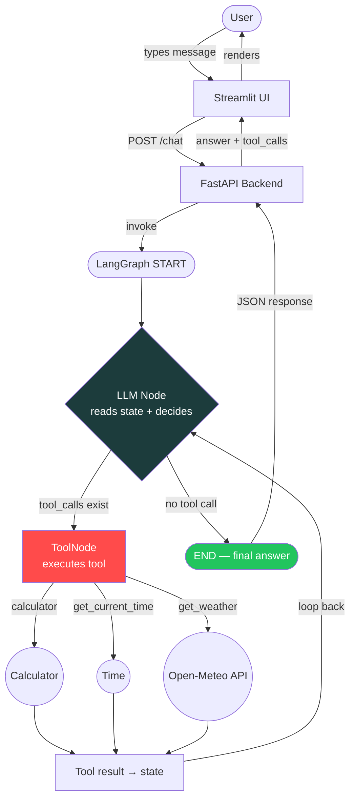

# 🤖 Agentic Chatbot — LangGraph Day 4

> An end-to-end, tool-using agentic chatbot built with **LangGraph**, **FastAPI**, and **Streamlit** — containerized with **Docker**.


---

## 📌 Overview

This project demonstrates a **production-style agentic chatbot** where an LLM doesn't just generate text — it can **decide to call tools**, observe the results, and loop back to produce a final, grounded answer.

```
User → Streamlit UI → FastAPI → LangGraph Agent → LLM ⇄ Tools → Final Answer → UI
```

---

## 🧰 Tech Stack

| Layer          | Technology                                   | Role                                            |
| -------------- | -------------------------------------------- | ----------------------------------------------- |
| 🎨 UI          | **Streamlit**                                | Chat interface in the browser                   |
| ⚡ API         | **FastAPI**                                  | HTTP backend and API contract                   |
| 🕸️ Agent       | **LangGraph**                                | Graph state, nodes, edges, agent control flow   |
| 🔗 Integration | **LangChain**                                | Messages, tools, model binding                  |
| 🧠 Model       | **gpt-5.6-luna** (Experiential Labs gateway) | Natural language understanding + tool selection |
| 🛠️ Tools       | Python functions + **Open-Meteo API**        | Calculator, time, weather                       |
| 📦 Packaging   | **Docker + Compose**                         | Repeatable, isolated local runtime              |

---

## 🔄 Workflow Orchestration



**The Agent Loop:** `LLM → decide → tool (if needed) → observe result → LLM → decide again → final answer`
This loop is what makes it _agentic_ — not a single pass, but a decision-and-act cycle.

---

## 🛠️ Available Tools

| Tool               | Description                                                                                                                       |
| ------------------ | --------------------------------------------------------------------------------------------------------------------------------- |
| `calculator`       | Evaluates arithmetic expressions (`+ - * / % **`, parentheses), returns a safe error message instead of crashing on invalid input |
| `get_current_time` | Returns current date/time for any valid IANA timezone (e.g. `Asia/Kolkata`)                                                       |
| `get_weather`      | Returns live temperature, humidity, and wind speed for any city via Open-Meteo (no API key required)                              |

---

## 📁 Project Structure

```
agentic-chatbot/
├── app/
│   ├── main.py            # FastAPI app + /chat endpoint
│   ├── config.py          # Env/config loader
│   ├── schemas.py         # Request/response models
│   └── agent/
│       ├── tools.py       # calculator, get_current_time, get_weather
│       └── graph.py       # LangGraph StateGraph + agent loop
├── ui/
│   └── streamlit_app.py   # Chat frontend
├── requirements.txt
├── .env.example
├── Dockerfile
├── compose.yaml
└── README.md
```

---

## ⚙️ Environment Variables

| Variable                        | Description                                    |
| ------------------------------- | ---------------------------------------------- |
| `EXPERIENTIAL_LABS_API_KEY`     | API key for the Experiential Labs gateway      |
| `EXPERIENTIAL_BASE_URL`         | Gateway base URL (OpenAI-compatible endpoint)  |
| `MODEL_NAME`                    | Chat model, e.g. `gpt-5.6-luna`                |
| `BACKEND_HOST` / `BACKEND_PORT` | FastAPI bind host/port                         |
| `BACKEND_URL`                   | URL the Streamlit UI uses to reach the backend |

---

## 🚀 Local Setup

```bash
# 1. Create virtual environment
python -m venv .venv
.\.venv\Scripts\Activate.ps1

# 2. Install dependencies
pip install -r requirements.txt

# 3. Configure environment
copy .env.example .env
# → add your EXPERIENTIAL_LABS_API_KEY and EXPERIENTIAL_BASE_URL

# 4. Run backend (Terminal 1)
uvicorn app.main:app --reload --host 127.0.0.1 --port 8000

# 5. Run UI (Terminal 2)
streamlit run ui/streamlit_app.py
```

- 📄 API docs → http://127.0.0.1:8000/docs
- 💬 Chat UI → http://localhost:8501

---

## 🐳 Docker Setup

```bash
# 1. Ensure .env exists (from .env.example)

# 2. Build the image
docker build -t agentic-chatbot:day4 .

# 3. Start backend + UI containers together
docker compose up --build
```

- 💬 UI → http://localhost:8501
- 📄 API docs → http://localhost:8000/docs

Stop everything:

```bash
docker compose down
```

---

## 🧪 Example Queries to Try

| Query                                | Expected behavior              |
| ------------------------------------ | ------------------------------ |
| `"What is 45 * 17?"`                 | Calls `calculator`             |
| `"What time is it in Asia/Kolkata?"` | Calls `get_current_time`       |
| `"What's the weather in Indore?"`    | Calls `get_weather`            |
| `"Explain what an API is"`           | Answers directly, no tool call |

---

## ✅ Status

| Feature                           | Status   |
| --------------------------------- | -------- |
| Tool-calling agent loop           | ✅       |
| Conditional routing               | ✅       |
| Dockerized (FastAPI + Streamlit)  | ✅       |
| Persistent memory / checkpointing | 🔜 Day 5 |
| Human-in-the-loop                 | 🔜 Day 5 |
